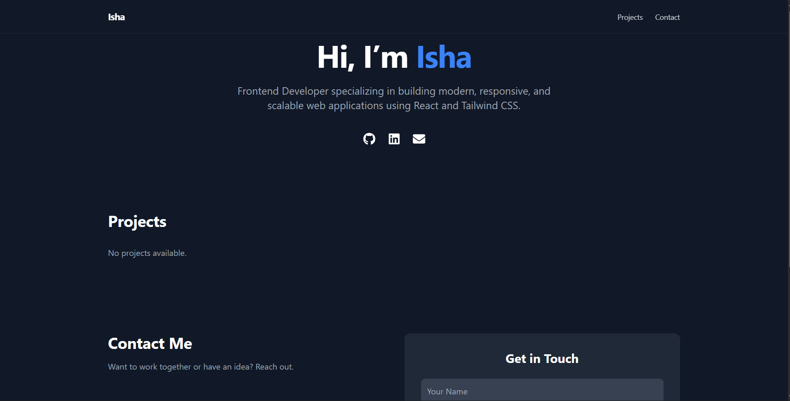
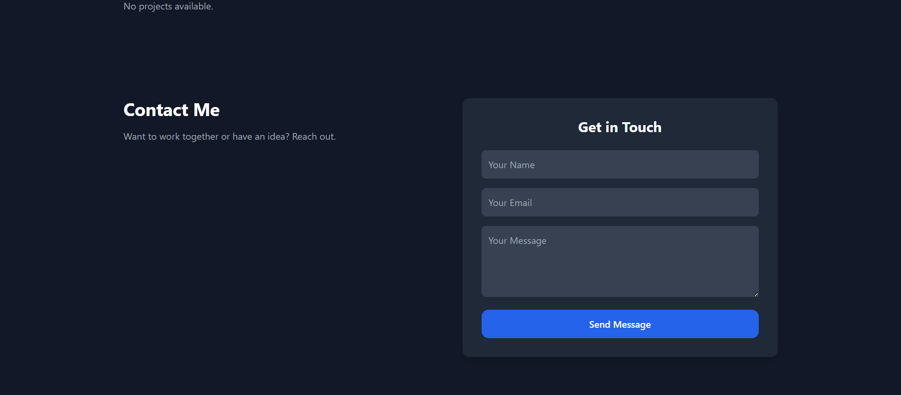
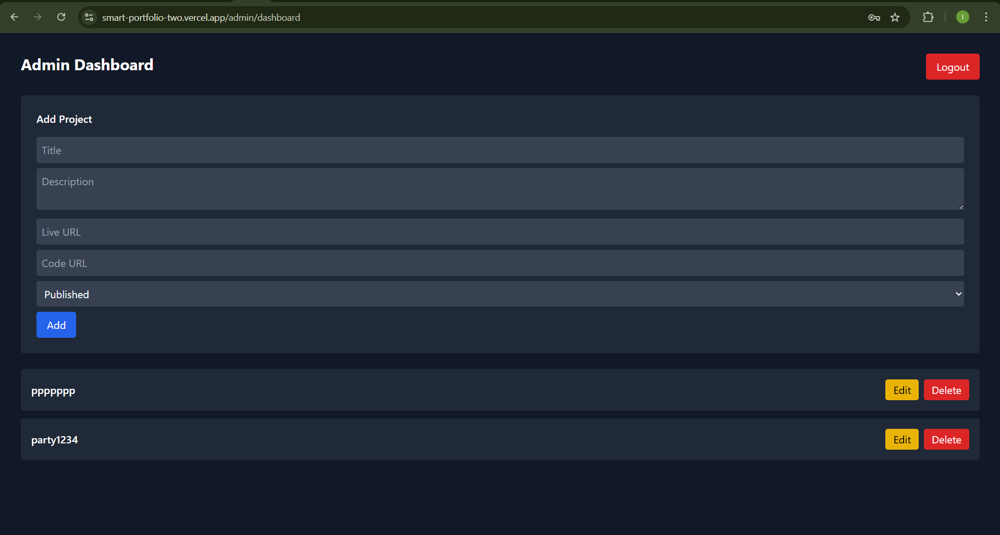
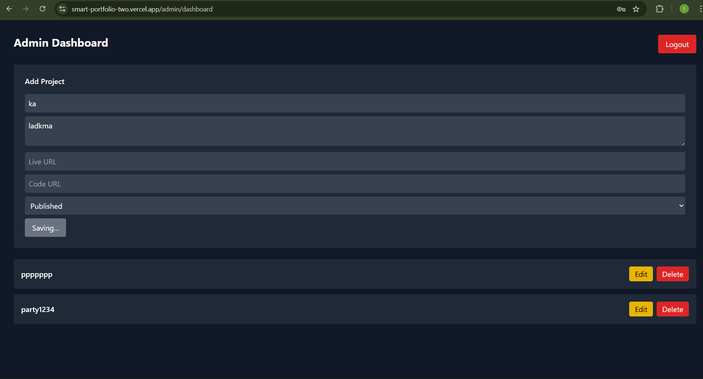
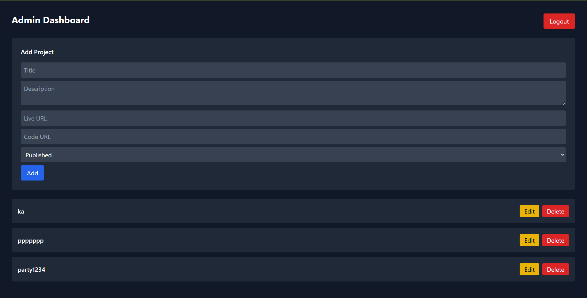

# Smart Portfolio with Admin CMS

A full-stack portfolio application with a secure admin panel to manage projects dynamically.  
Designed to simulate a real-world CMS used in production environments.

---

## 🚀 Live Demo

- 🌐 Frontend: https://smart-portfolio-two.vercel.app/
- 🔐 Admin Panel: https://smart-portfolio-two.vercel.app/admin

---

## 🛠 Tech Stack

**Frontend**
- React
- Tailwind CSS
- Axios
- React Router

**Backend**
- Node.js
- Express.js
- MongoDB Atlas
- Mongoose
- JWT Authentication

**Deployment**
- Frontend: Vercel
- Backend: Render

---

## ✨ Features

### Public Portfolio
- Responsive UI
- Displays only published projects
- Smooth scrolling navigation
- Contact form

### Admin Dashboard
- Secure admin login (JWT-based)
- Protected routes
- Add, edit, delete projects
- Draft / Publish toggle (CMS workflow)
- Real-time updates
- Auto logout on unauthorized access

---

## 🔐 Authentication Flow

- Admin logs in using credentials
- JWT token stored in localStorage
- Axios interceptors attach token to protected API calls
- Backend middleware verifies token before allowing access

---

## 📦 API Endpoints

### Auth
- `POST /api/admin/login`
- `POST /api/admin/register` (one-time)

### Projects
- `GET /api/projects`
- `POST /api/projects` (protected)
- `PUT /api/projects/:id` (protected)
- `DELETE /api/projects/:id` (protected)

---

## 🧪 How to Run Locally

### Backend
```bash
cd server
npm install
npm run dev

### Frontend
cd client
npm install
npm run dev

## Create a .env file inside server/:
MONGO_URI=your_mongodb_connection_string
JWT_SECRET=your_secret_key


##Screenshots





